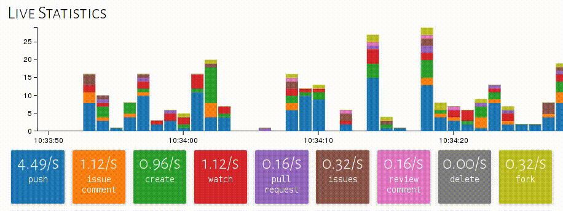

# GitHub Realtime Relay [](https://travis-ci.org/lukasmartinelli/ghrr) [](https://codeclimate.com/github/lukasmartinelli/ghrr)

Receive all GitHub events in realtime with [socket.io](http://socket.io/) from the [GitHub Realtime Relay](http://ghrr.lukasmartinelli.ch) which polls all public events and then relays them directly via websockets. 
This is probably the simplest way to create a realtime application on top of GitHub.

Below you see a statistics page of GitHub events built on top of [GHRR](http://ghrr.lukasmartinelli.ch).

[](http://ghrr.lukasmartinelli.ch)

For a short tutorial head over to
[my blog post about GHRR](http://lukasmartinelli.ch/web/2015/07/29/github-realtime-relay.html) or continue reading. For a more sophisticated usage example checkout my other project [delptr](http://github.com/lukasmartinelli/delptr), which lints all C++ commits in realtime.

## Connect from Server (Node)

Install the [socket.io-client](https://www.npmjs.org/package/socket.io-client) from npm.

```bash
npm install socket.io-client
```

To receive all events you can hook onto the `/events` namespace
and subscribe to a [specific GitHub Event](https://developer.github.com/v3/activity/events/types/). Please use lower case for subscribing to the event types.

```javascript
var url = 'http://ghrr.lukasmartinelli.ch:80/events';
var socket = require('socket.io-client')(url);

socket.on('pushevent', function(event){
   console.log('Push: ' + event.repository.full_name);
});

```

There is also a `/statistics` namespace used by the GHRR web interface that
sends usage statistics for the Event Types.

```javascript
var url = 'http://ghrr.lukasmartinelli.ch:80';
var io = require('socket.io-client')(url);
io('/statistics').on('types', function(typeCounts) {
    console.log('PushEvents: ' + typeCounts.pushevent);
}
```

## Connect from Web Application

You need to add the socket.io-client to your web application.

```html
<script src="//cdn.jsdelivr.net/socket.io-client/1.2.0/socket.io.js"></script>
```

You can now connect directly to the public websocket. We support
[CORS](http://www.html5rocks.com/en/tutorials/cors/)
for all domains so you should not encounter any problems.

```javascript
var url = 'http://ghrr.lukasmartinelli.ch:80/events';
var socket = io(url);

socket.on('pushevent', function (event) {
   console.log('Push: ' + event.repository.full_name);
});
```

## Host it yourself

In order to poll all events you need an OAUTH access token.
Run the github realtime relay with a poll rate of `1000` and on port `3000`.

```bash
docker pull lukasmartinelli/ghrr
docker run -e GITHUB_TOKEN="acbas3dfas.." -p 3000:3000 lukasmartinelli/ghrr
```
