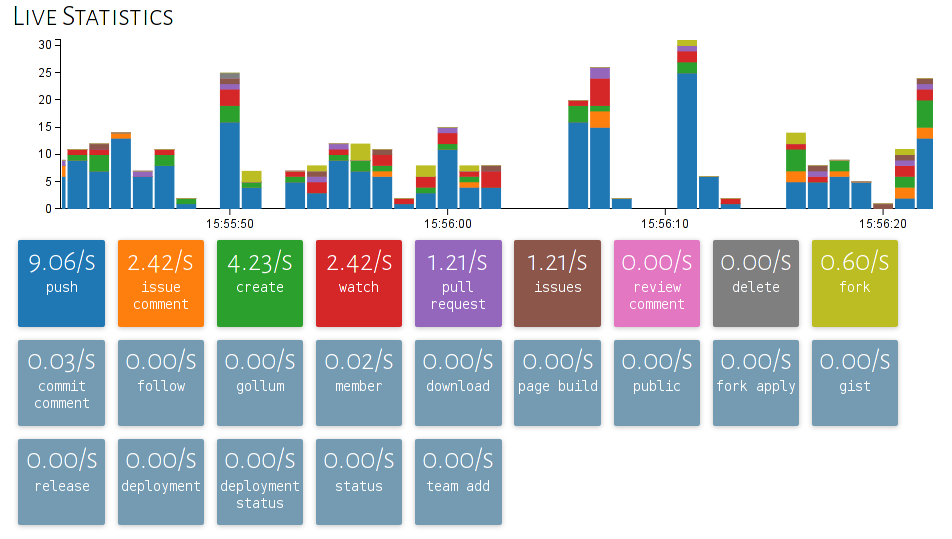

Github Realtime Relay
======================

Receive all Github events in realtime with [socket.io](http://socket.io/) from the [Github Realtime Relay](http://oghrr.lukasmartinelli.ch/).
This is probably the simplest way to create a realtime application on top of Github.


## Server (Node)

Install the [socket.io-client](https://www.npmjs.org/package/socket.io-client) from npm.

```bash
npm install socket.io-client
```

To receive all events you can hook onto the `/events` namespace
and subscribe to a [specific Github Event](https://developer.github.com/v3/activity/events/types/). Please use lower case for subscribing to the event types.

```javascript
var url = 'http://ghrr.lukasmartinelli.ch:80/events';
var socket = require('socket.io-client')(url);

socket.on('pushevent', function(event){
   console.log('Push: ' + event.repository.full_name);
});

```

There is also a `/statistics` namespace used by the GHRR web interface that
sends usage statistics for the Event Types.

```javascript
var url = 'http://ghrr.lukasmartinelli.ch:80';
var io = require('socket.io-client')(url);
io('/statistics').on('types', function(typeCounts) {
    console.log('PushEvents: ' + typeCounts.pushevent);
}
```

## Web Application

You need to add the socket.io-client to your web application.

```html
<script src="//cdn.jsdelivr.net/socket.io-client/1.2.0/socket.io.js"></script>
```

You can now connect directly to the public websocket. We support
[CORS](http://www.html5rocks.com/en/tutorials/cors/)
for all domains so you should not encounter any problems.

```javascript
var url = 'ghrr.lukasmartinelli.ch:80/events';
var socket = io(url);

socket.on('pushevent', function (event) {
   console.log('Push: ' + event.repository.full_name);
});
```

## Host it yourself

Install with npm.

```bash
npm install ghrr
```

In order to poll all events you need an OAUTH access token.
Run the github realtime relay with a poll rate of `1000` and on port `80`.

```bash
npm install ghrr
npm run start "YOUR GITHUB ACCESS TOKEN" 1000 80
```

Now you can visit the  status page displaying live statistics.

 
